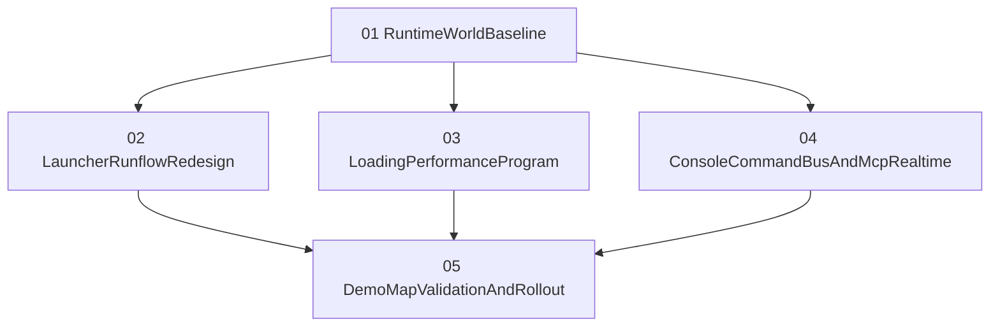

# Myfunc Task Stream

Owner stream for the runtime world/UX/control-system overhaul.

Status: `planned`

## Scope Index
- `01-runtime-world-baseline.md`
- `02-launcher-and-runflow-redesign.md`
- `03-loading-performance-program.md`
- `04-console-command-bus-and-mcp-realtime.md`
- `05-demo-map-validation-and-rollout.md`

## Dependency Graph

## Why This Order
- Scope 01 sets renderer and world behavior defaults (skybox/fog/runtime path consistency).
- Scope 02 aligns launcher and in-game run UX with new defaults.
- Scope 03 removes current loading pain points before broad rollout.
- Scope 04 introduces the command bus and MCP scene tooling needed for real-time authoring.
- Scope 05 validates everything end-to-end on `demo.map` and imported maps.
